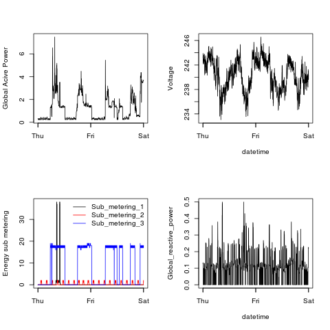

## Introduction

Fork of the assigment repository, contains four R scripts that generate the plots
plus a fifth (ReadData.R) which encapsulates the process of geting the data,
cleaning it and generating a dataframe for the other scripts.

The four plots that are created are shown below. 

### Plot 1

 

### Plot 2

 

### Plot 3

 

### Plot 4

 

